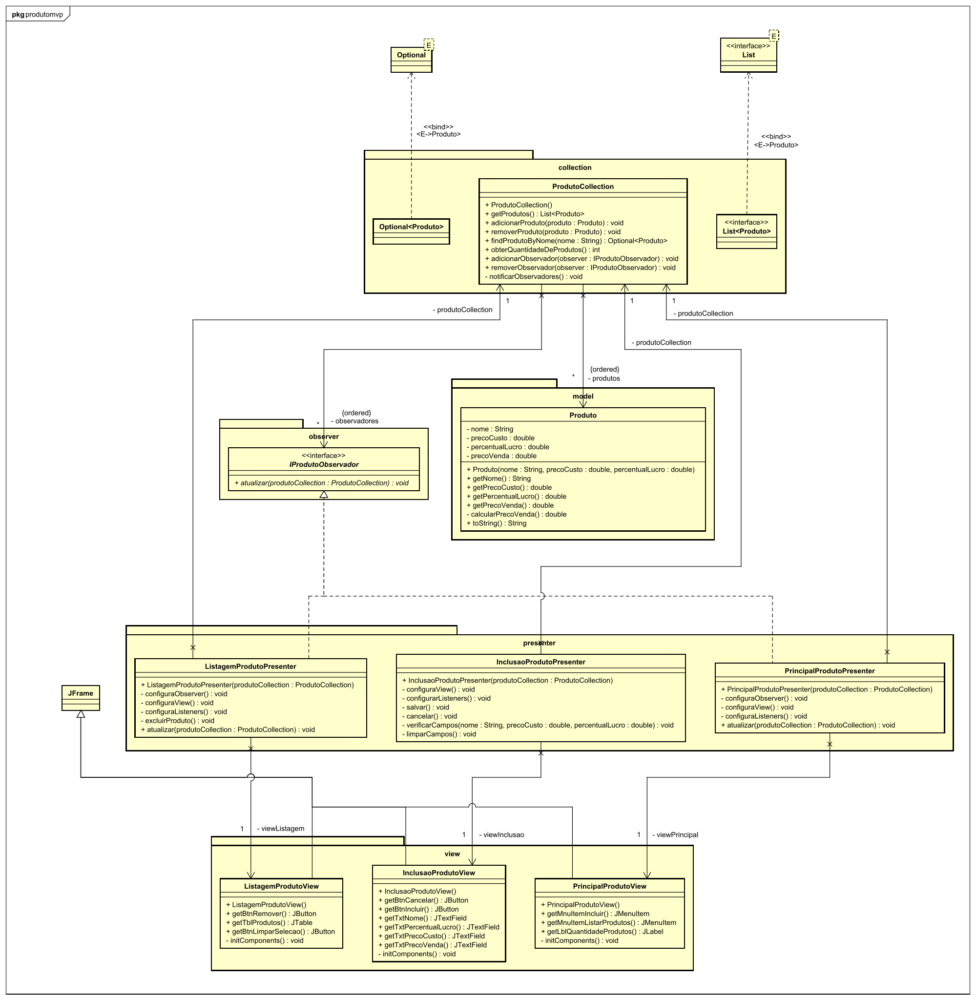

# Produto MVP

Projeto desenvolvido na disciplina de Projeto de Sistemas de Software com foco no padrão MVP (Model-View-Presenter) - Passive view e na gestão e controle de produtos.

## 🎯 Objetivo

- O projeto implementa uma arquitetura MVP (Model-View-Presenter - Passive View).
- Sistema para controle de estoque e gestão de produtos.
- A implementação atende aos princípios de design orientado a objetos e utiliza Java 17 e Maven.

## 🛠️ Funcionalidades atuais

- Inclusão de produtos
- Remoção de produtos

## 📐 Diagrama de classes

O diagrama de classes podem ser encontrado na pasta `/diagramaclasses` [(Clique aqui)](diagramaclasses/).

## 📋 Requisitos
- **Linguagem**: Java 17.
- **Gerenciador de Dependências**: Maven.